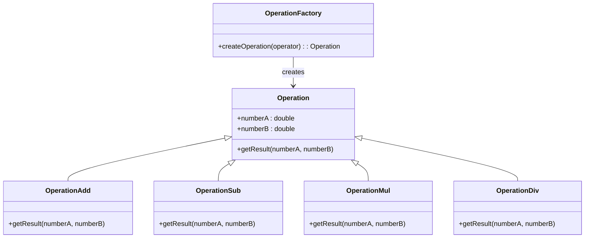
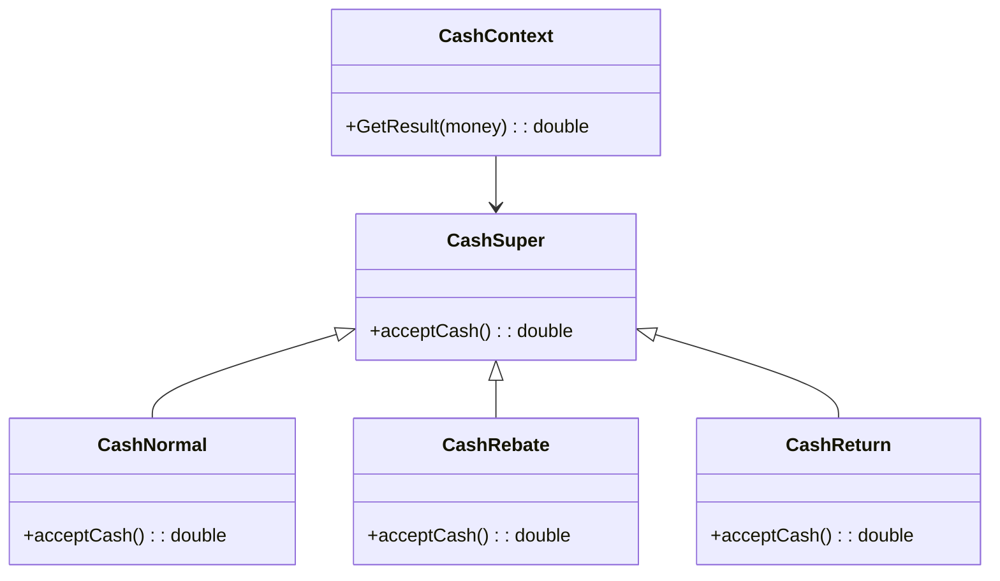
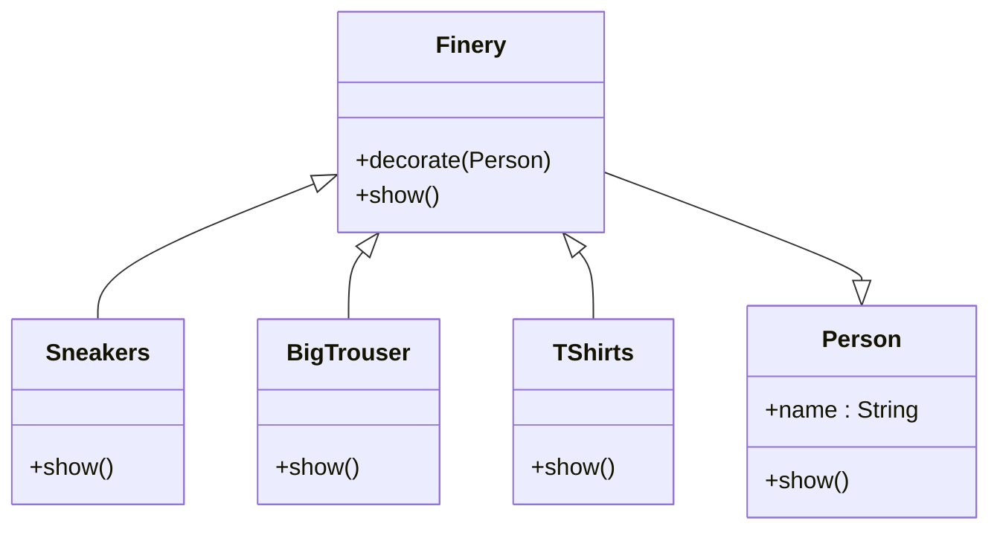
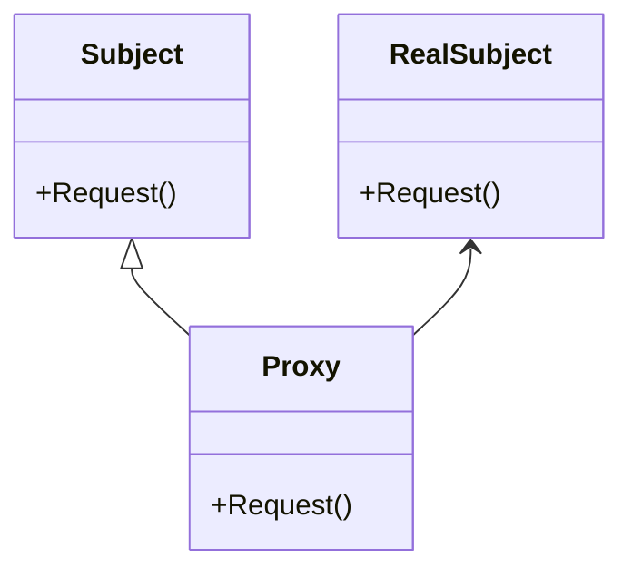

# OOP 面向对象设计模式

## 设计原则
### 单一职责原则

The Single Responsibility Principle，简称 SRP，是指就一个类而言，应该仅有一个更改它的原因。也即这个类只有一个职责。

### 开闭原则

The Open-Closed Principle，简称 OCP，是指软件实体（类、模块、函数等）应该可以扩展，但是不可以修改。即对于扩展是开放的，对于更改是封闭的。通俗来说就是对于要增加的新功能或要调整的改动，尽量扩展新代码而不是修改已有代码。

### 依赖倒置原则

Dependence Inversion Principle，简称 DIP，是指程序不应该依赖细节，细节应该依赖于抽象。简单来说，就是要针对接口编程，不要针对实现编程。

### 里氏替换原则

Liskov Substituion Principle，简称 LSP，一个软件实体如果使用的是一个父类的话，一定适用于其子类，而且它察觉不出父类和子类的区别。也就是说，在软件里面，把父类都替换成它的子类，程序的行为没有变化。简单来说，子类型必须能够替换掉它们的父类型。

### 迪米特法则

Law of Demeter，简称 LoD，也叫最小知识原则。是指如果两个类不必彼此互相通信，那么这两个类就不应当发生直接的相互作用；如果其中一个类需要调用另一个类的某一个方法，可以通过第三者转发这个调用。


## 设计模式

### 简单工厂模式（Simple Factory Pattern）
- 是用一个单独的类来实现具体的实例化过程，避免**客户端**对具体实例化过程的显式指定。
  - 只说一次，客户端就是这个项目的 Calculator.java 是使用该模式的入口，后面的项目也是如此区分，客户端不会放在UML图中
- `java/src/calculator`
- 简单工厂模式由三类主要角色组成：
  * *抽象类*：定义所有支持算法的公共接口，在这个例子中具体运算抽象类；
  * *具体算法类*：具体的算法，在这个例子中具体为加减乘除运算类；
  * *简单工厂类*：维护对运算类的应用。
- 适用于使用者可以在不清楚类生产的具体过程的情况下，使用不同的产品

- *解决方案*
  * 首先定义一个抽象的运算类Operation，定义抽象类的同时定义其所有子类的公共接口，并定义一个方法getResult(numberA,numberB)用于得到结果；
  * 分别创造具体的加减乘除运算类，都为抽象运算类的子类，则具体运算类之中若有一者需要修改，不会影响其它的运算类。覆写具体运算类中
  * getResult(numberA,numberB)方法实现运算操作；
  * 创建简单工厂类OperationFactory，根据输入参数，使用条件判断调用具体的运算类，实现业务逻辑和界面逻辑的分离。



### 策略模式（Strategy Pattern）
- 是指定义一个*算法家族*，使得家族内的不同算法都遵从算法家族的接口及方法规范，从而可以实现算法间互相替换，且不会影响到使用算法的客户。
- `java/src/cashclient`
- 适用于内部算法很多，经常变化的情况
- 简化了单元测试，每个算法都有自己的类，可以通过自己的接口单独测试
- 符合*开放封闭原则*，无需对上下文修改就可以引进新的策略
- 策略模式由三类主要角色组成：
  * *策略类*：定义所有支持算法的公共接口，在这个例子中具体为收费抽象类；
  * *具体策略类*：具体的算法，在这个例子中具体为各类收费类和折扣优惠收费类；
  * *上下文类*：维护对策略对象的应用。



### 装饰模式（Decorator Pattern）

- 是指创建一个*装饰类*，来*包装原有的类*，从而*实现动态地向一个现有的对象添加一些额外的职责*，同时不改变其原有的结构。装饰模式比生成子类更为灵活。
- `java/src/decoratorclient`
  - Person类相当于ConcreteComponent，装饰组件
  - Finery类相当于Decorator，是装饰器，这个单词意思就是服饰
  - 具体的服饰类们，相当于ConcreteDecorator，是具体的装饰们
  - **看起来像是将很多衣服都装饰在人的身上，但是实际是一种嵌套的感觉，装饰过的person就变成了另一种组件了**
- 装饰模式由四类主要角色组成：
  * *实体接口*：对象接口的定义，可以为对象动态添加职责，在这个例子中职责具体为形象展示的过程，由于Person类在此程序中只有形象展示这一个职责，Person类既是访问接口，也是实体类；
  * *实体类*：在这个例子中具体为Person类；
  * *装饰抽象类*：继承实体接口，动态扩展其职责，在这个例子中具体为服饰抽象类；
  * *具体装饰类*：装饰的具体实现，在这个例子中具体为各类服饰类，如大T恤，大垮裤等。
- 可以在不生成很多子类的情况下扩展类，适用于扩展类需求较多，而又不想引起子类膨胀的场景。



### 代理模式（Proxy Pattern）

- 是指实现一个类代表另一个类的功能，为其他对象提供一种代理以控制对这个对象的访问。
- `java/src/proxyclient`
- 代理模式由三个主要角色组成：
  - *访问接口*：在这个例子中具体为送礼物的行为；
  - *实体类*：在这个例子中具体为追求者；
  - *替代实体的代理类*：在这个例子中具体为代理。
- 不方便直接访问对象时，为不宜直接访问的对象提供一个访问层。
- 使用代理模式的方式分为以下几种：
  - 本地执行远程服务（远程代理）：适用于服务对象位于远程服务器上的情形，可以为一个对象在不同的地址空间提供局部代表。
  - 延迟初始化（虚拟代理）：如果你有一个偶尔使用的重量级服务对象，一直保持该对象运行会消耗系统资源时，可使用代理模式。
  - 访问控制（保护代理/安全代理）：如果只希望特定客户端使用服务对象，对象可以是操作系统中的重要部分，而客户端则是各种已启动程序，可使用代理模式。
  - 记录日志请求（日志记录代理）：适用于需要保存对于服务对象的请求历史记录时。
  - 缓存请求结果（缓存代理）：适用于需要缓存客户请求结果并对缓存生命周期进行管理时，特别是返回结果体积非常大时。
  - 智能指引：调用真实对象时，代理处理另外一些事，可在没有客户端使用某个重量级对象时，立刻销毁该对象。



### 工厂方法模式（Factory Method Pattern）

- 是指定义一个*用于创建对象的结构*，让子类决定实例化哪个类。工厂方法使类的实例化过程延迟到其子类。
- 工厂方法模式实现时，*客户端需要决定*实例化哪一个工厂来实现功能类，即将简单工厂内部的逻辑判断已到了客户端进行。
- 这一程序可以先用简单工厂模式实现，但由于学雷锋的学生毕业后，会转变身份成为社区志愿者，此时若使用简单工厂模式会涉及到工厂类的修改，违背开放封闭原则。当我们使用工厂方法模式时，可以对学雷锋的学生和社区志愿者分别建立工厂类，让客户端决定实例化哪一个工厂类。所以这是**多盖两间工厂的意思。**
- 解决方案：
  * 创建抽象类LetFeng，同时定义公共接口，即三种好事：
  * 定义方法Sweep()，Wash()，BuyRice()。
  * 创建具体的做好事的类：学雷锋的大学生Undergraduate，及社区志愿者Volunteer，继承于抽象类LetFeng；
  * 创建雷锋工厂类IFactory，再定义学雷锋的大学生工厂UndergraduateFactory和社区志愿者工厂VolunteerFactory继承于雷锋工厂，用于创建具体的对象。

- **自我理解**：
  - 不同的类行使相同的行为，但是叫不同的类名
  - 使用工厂生成不同的类
  - 简单工厂模式则为只针对一个类进行扩展，是一个类产生多个类，这里的是生成继承某行为的类

### 原型模式（Prototype）

- 是创建型模式的一种。它用原型实例指定创建对象的种类，并通过拷贝这些原型创建新的对象。
- 通过复制一个已存在的实例，返回新的实例（没有新建实例），原型指被复制的实例；实现克隆操作，必须实现 Cloneable接口。
- `java/src/resumeclient`
- 原型模式的组成：
  * 原型接口（Prototype Interface）：定义一个用于克隆自身的接口，一般包含一个克隆方法。
  * 具体原型类（Concrete Prototype）：实现原型接口并定义如何复制自身的具体逻辑。
  * 客户端（Client）：使用具体原型类来创建新的对象，通过调用克隆方法来复制对象。
- **就像游戏里的大批怪兽，使用原型类，就可以快速复制，然后设置一些新的属性。**

### 模板方法模式（Template Method）

- 学生抄试卷的案例，试卷时模板，学生只提供答案的一种模式
- `java/src/templatemethod`
- 解决方案：
  * 对于不同的学生，只有给出的答案不同，其他内容全都一样；
  * 将所有的重复代码都上升到父类，使其称为子类的模板 --> 将公共的试题代码写到父类，试题和答案都继承于它；
  * 只将答案改成一个虚方法，给继承的子类重写；
  * 在客户端代码中，将子类变量的声明改成父类，利用多态实现代码复用。
- 适用场景
  * 有多个子类共有的方法，且逻辑相同；
  * 重要的、复杂的方法，可以考虑作为模板方法。


## Java的基础


## 其他学习思考笔记

抽象类是一种特殊的类，它不能被直接实例化，只能被继承。抽象类的主要用途是为子类提供一种模板，定义某些方法而不具体实现它们。这种设计可以在面向对象编程中实现多态性和代码重用。

- 工厂模式是根据输入的*参数不同*可以得到不同的结果，当需要为简单的对象创建逻辑的时候
- 策略类主要*封装算法和行为*，并希望在运行时选择其中之一
- 装饰器模式，通过一系列装饰者类叠加对象，会有很多小的类生成，用于*动态扩展对象功能*

代码执行方法：

```bash
(base) sallyw@sallywnoMacBook-Air inheritance % javac -d out src/*
(base) sallyw@sallywnoMacBook-Air inheritance % cd out
(base) sallyw@sallywnoMacBook-Air out % java inheritance.src.Main
3.605551275463989
(base) sallyw@sallywnoMacBook-Air out %
```

这种方法的意思在于，当编译java文件的时候，我去src同级，也就是项目root路径，然后执行编译，全部输出到out，然后在out中，执行java命令，call出client的Main方法！
