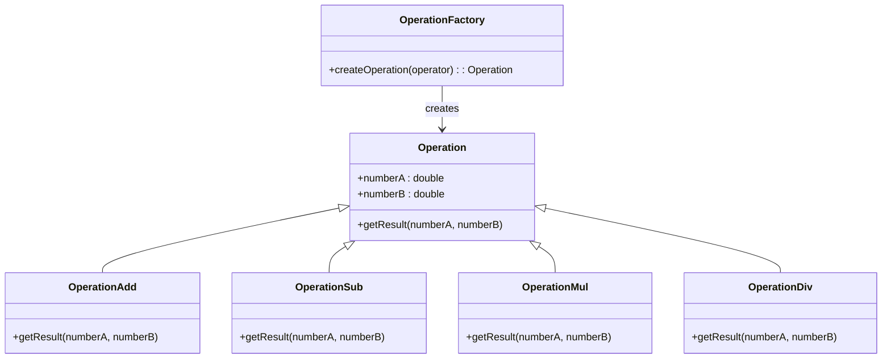
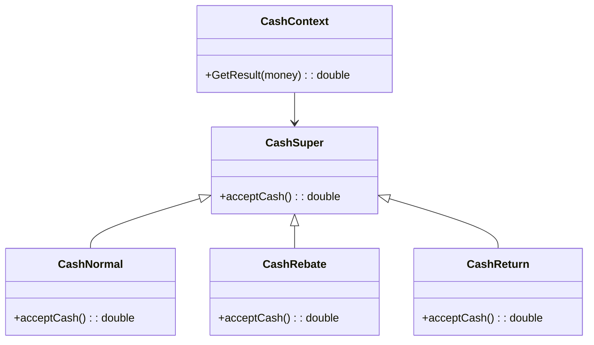
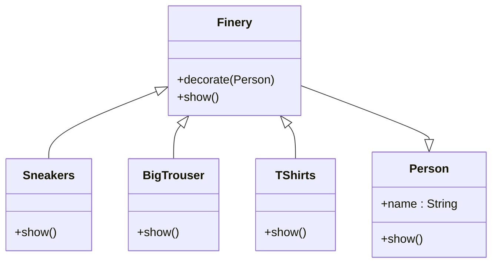
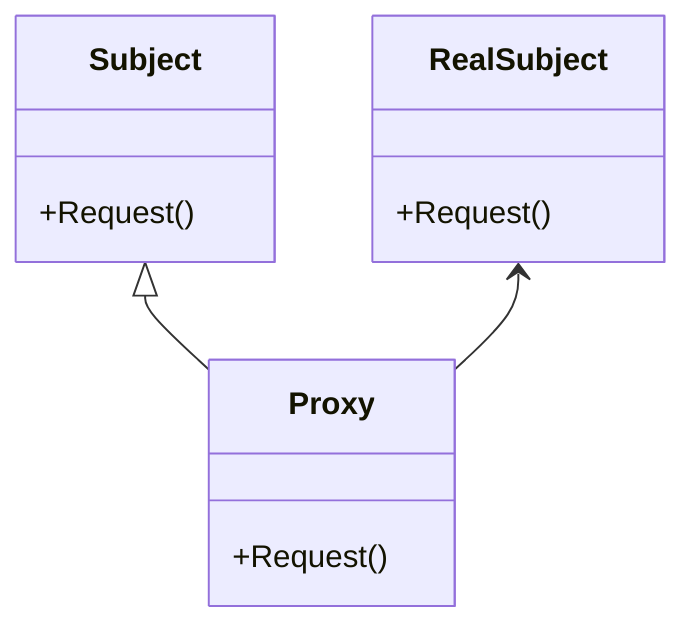

# OOP 面向对象设计模式

- 面向对象编程
  - 封装：（Encapsulation）封装的是实现细节，对外只提供接口，getter/setter，set方法中可以验证逻辑合法，有时候为了保护数据可以不设置setter，并且使用关键字封装内部属性
  - 继承：（Inheritance）父类的所有内容都被继承，并且可以添加属性和方法/Override（多态）方法，父类要使用子类的方法可以用抽象方法（强制实现子类以使用方法）
  - 多态：（Polymorphism）通过方法重写和方法重载来实现。方法重写（Override）用于实现运行时多态，支持父类引用指向子类对象，动态选择调用的方法；方法重载（Overload）则用于编译时多态，在编译时根据方法签名（不同参数）的不同选择合适的方法实现。多态的核心思想是让程序在不同对象上执行相同操作时，能够根据具体对象的类型表现出不同的行为，抽象定义接口，多态实现行为
  - 抽象：（abstraction）关于什么时候用抽象方法抽象类
    - 父类不一定需要抽象类：当父类可以提供通用的默认实现时，普通类即可满足需求！
    - 使用抽象类/接口的场景：当你希望*强制子类实现某些行为*（因为抽象方法必须被实现），或者*父类无法提供适合的默认实现*（比如shape类本身是没有面积计算功能的）时，抽象类或接口是合适的选择。接口可以提供更高的灵活性，因为类可以实现多个接口。
    - 设计灵活性：抽象类和接口有助于代码的扩展性和灵活性，使程序能够在将来轻松引入新功能。

[学习网站链接，感谢大大](https://datawhalechina.github.io/sweetalk-design-pattern/#/)

## 设计原则
### 单一职责原则

The Single Responsibility Principle，简称 SRP，是指就一个类而言，应该仅有一个更改它的原因。也即这个类只有一个职责。

### 接口隔离原则

### 开闭原则

The Open-Closed Principle，简称 OCP，是指软件实体（类、模块、函数等）应该可以扩展，但是不可以修改。即对于扩展是开放的，对于更改是封闭的。通俗来说就是对于要增加的新功能或要调整的改动，尽量扩展新代码而不是修改已有代码。

### 依赖倒置原则

Dependence Inversion Principle，简称 DIP，是指程序不应该依赖细节，细节应该依赖于抽象。简单来说，就是要针对接口编程，不要针对实现编程。

### 里氏替换原则

Liskov Substituion Principle，简称 LSP，一个软件实体如果使用的是一个父类的话，一定适用于其子类，而且它察觉不出父类和子类的区别。也就是说，在软件里面，把父类都替换成它的子类，程序的行为没有变化。简单来说，子类型必须能够替换掉它们的父类型。

### 迪米特法则

Law of Demeter，简称 LoD，也叫最小知识原则。是指如果两个类不必彼此互相通信，那么这两个类就不应当发生直接的相互作用；如果其中一个类需要调用另一个类的某一个方法，可以通过第三者转发这个调用。

### 合成复用原则


## 设计模式

### 简单工厂模式（Simple Factory Pattern）
- 是用一个单独的类来实现具体的实例化过程，避免**客户端**对具体实例化过程的显式指定。
  - 只说一次，客户端就是这个项目的 Calculator.java 是使用该模式的入口，后面的项目也是如此区分，客户端不会放在UML图中
- `java/src/calculator`
- 简单工厂模式由三类主要角色组成：
  * *抽象类*：定义所有支持算法的公共接口，在这个例子中具体运算抽象类；
  * *具体算法类*：具体的算法，在这个例子中具体为加减乘除运算类；
  * *简单工厂类*：维护对运算类的应用。
- 适用于使用者可以在不清楚类生产的具体过程的情况下，使用不同的产品

- *解决方案*
  * 首先定义一个抽象的运算类Operation，定义抽象类的同时定义其所有子类的公共接口，并定义一个方法getResult(numberA,numberB)用于得到结果；
  * 分别创造具体的加减乘除运算类，都为抽象运算类的子类，则具体运算类之中若有一者需要修改，不会影响其它的运算类。覆写具体运算类中
  * getResult(numberA,numberB)方法实现运算操作；
  * 创建简单工厂类OperationFactory，根据输入参数，使用条件判断调用具体的运算类，实现业务逻辑和界面逻辑的分离。



### 策略模式（Strategy Pattern）
- 是指定义一个*算法家族*，使得家族内的不同算法都遵从算法家族的接口及方法规范，从而可以实现算法间互相替换，且不会影响到使用算法的客户。
- `java/src/cashclient`
- 适用于内部算法很多，经常变化的情况
- 简化了单元测试，每个算法都有自己的类，可以通过自己的接口单独测试
- 符合*开放封闭原则*，无需对上下文修改就可以引进新的策略
- 策略模式由三类主要角色组成：
  * *策略类*：定义所有支持算法的公共接口，在这个例子中具体为收费抽象类；
  * *具体策略类*：具体的算法，在这个例子中具体为各类收费类和折扣优惠收费类；
  * *上下文类*：维护对策略对象的应用。



### 装饰模式（Decorator Pattern）

- 是指创建一个*装饰类*，来*包装原有的类*，从而*实现动态地向一个现有的对象添加一些额外的职责*，同时不改变其原有的结构。装饰模式比生成子类更为灵活。
- `java/src/decoratorclient`
  - Person类相当于ConcreteComponent，装饰组件
  - Finery类相当于Decorator，是装饰器，这个单词意思就是服饰
  - 具体的服饰类们，相当于ConcreteDecorator，是具体的装饰们
  - **看起来像是将很多衣服都装饰在人的身上，但是实际是一种嵌套的感觉，装饰过的person就变成了另一种组件了**
- 装饰模式由四类主要角色组成：
  * *实体接口*：对象接口的定义，可以为对象动态添加职责，在这个例子中职责具体为形象展示的过程，由于Person类在此程序中只有形象展示这一个职责，Person类既是访问接口，也是实体类；
  * *实体类*：在这个例子中具体为Person类；
  * *装饰抽象类*：继承实体接口，动态扩展其职责，在这个例子中具体为服饰抽象类；
  * *具体装饰类*：装饰的具体实现，在这个例子中具体为各类服饰类，如大T恤，大垮裤等。
- 可以在不生成很多子类的情况下扩展类，适用于扩展类需求较多，而又不想引起子类膨胀的场景。



### 代理模式（Proxy Pattern）

- 是指实现一个类代表另一个类的功能，为其他对象提供一种代理以控制对这个对象的访问。
- `java/src/proxyclient`
- 代理模式由三个主要角色组成：
  - *访问接口*：在这个例子中具体为送礼物的行为；
  - *实体类*：在这个例子中具体为追求者；
  - *替代实体的代理类*：在这个例子中具体为代理。
- 不方便直接访问对象时，为不宜直接访问的对象提供一个访问层。
- 使用代理模式的方式分为以下几种：
  - 本地执行远程服务（远程代理）：适用于服务对象位于远程服务器上的情形，可以为一个对象在不同的地址空间提供局部代表。
  - 延迟初始化（虚拟代理）：如果你有一个偶尔使用的重量级服务对象，一直保持该对象运行会消耗系统资源时，可使用代理模式。
  - 访问控制（保护代理/安全代理）：如果只希望特定客户端使用服务对象，对象可以是操作系统中的重要部分，而客户端则是各种已启动程序，可使用代理模式。
  - 记录日志请求（日志记录代理）：适用于需要保存对于服务对象的请求历史记录时。
  - 缓存请求结果（缓存代理）：适用于需要缓存客户请求结果并对缓存生命周期进行管理时，特别是返回结果体积非常大时。
  - 智能指引：调用真实对象时，代理处理另外一些事，可在没有客户端使用某个重量级对象时，立刻销毁该对象。



### 工厂方法模式（Factory Method Pattern）

- 是指定义一个*用于创建对象的结构*，让子类决定实例化哪个类。工厂方法使类的实例化过程延迟到其子类。
- 工厂方法模式实现时，*客户端需要决定*实例化哪一个工厂来实现功能类，即将简单工厂内部的逻辑判断已到了客户端进行。
- 这一程序可以先用简单工厂模式实现，但由于学雷锋的学生毕业后，会转变身份成为社区志愿者，此时若使用简单工厂模式会涉及到工厂类的修改，违背开放封闭原则。当我们使用工厂方法模式时，可以对学雷锋的学生和社区志愿者分别建立工厂类，让客户端决定实例化哪一个工厂类。所以这是**多盖两间工厂的意思。**
- 解决方案：
  * 创建抽象类LetFeng，同时定义公共接口，即三种好事：
  * 定义方法Sweep()，Wash()，BuyRice()。
  * 创建具体的做好事的类：学雷锋的大学生Undergraduate，及社区志愿者Volunteer，继承于抽象类LetFeng；
  * 创建雷锋工厂类IFactory，再定义学雷锋的大学生工厂UndergraduateFactory和社区志愿者工厂VolunteerFactory继承于雷锋工厂，用于创建具体的对象。

- **自我理解**：
  - 不同的类行使相同的行为，但是叫不同的类名
  - 使用工厂生成不同的类
  - 简单工厂模式则为只针对一个类进行扩展，是一个类产生多个类，这里的是生成继承某行为的类

### 原型模式（Prototype）

- 是创建型模式的一种。它用原型实例指定创建对象的种类，并通过拷贝这些原型创建新的对象。
- 通过复制一个已存在的实例，返回新的实例（没有新建实例），原型指被复制的实例；实现克隆操作，必须实现 Cloneable接口。
- `java/src/resumeclient`
- 原型模式的组成：
  * 原型接口（Prototype Interface）：定义一个用于克隆自身的接口，一般包含一个克隆方法。
  * 具体原型类（Concrete Prototype）：实现原型接口并定义如何复制自身的具体逻辑。
  * 客户端（Client）：使用具体原型类来创建新的对象，通过调用克隆方法来复制对象。
- **就像游戏里的大批怪兽，使用原型类，就可以快速复制，然后设置一些新的属性。**

### 模板方法模式（Template Method）

- 学生抄试卷的案例，试卷时模板，学生只提供答案的一种模式
- `java/src/templatemethod`
- 解决方案：
  * 对于不同的学生，只有给出的答案不同，其他内容全都一样；
  * 将所有的重复代码都上升到父类，使其称为子类的模板 --> 将公共的试题代码写到父类，试题和答案都继承于它；
  * 只将答案改成一个虚方法，给继承的子类重写；
  * 在客户端代码中，将子类变量的声明改成父类，利用多态实现代码复用。
- 适用场景
  * 有多个子类共有的方法，且逻辑相同；
  * 重要的、复杂的方法，可以考虑作为模板方法。

### 外观模式（Facade）：过程模式

- 还可以叫*过程模式*，我觉得这个不错，因为它将一组动作变成一个接口
- 适用于客户端不知道系统内部的复杂联系，只需要提供一个接待员即可
- 比如家庭影院各种功能，但是这里只需要一个遥控器，这个例子在cheatsheet中有
- 这里的是股票市场的例子
- `java.src.facade`相当于是一次性操作一堆的感觉

### 建造者模式（Builder）

- **生成器模式**
- 与工厂模式的区别，建造者模式更关注与零件配装的顺序
- 这个好难的说`java.src.builder`

### 观察者模式（Observer）

- 放哨模式`java.src.observer`
- 发布者-订阅者模式
- 整个流程中，会将订阅者加入，发布者的队列，根据发布者的行为，执行动作

### 抽象工厂模式（Abstract Factory）

- 是一种创建型设计模式，它提供了一种方法来创建一系列相关或相互依赖的对象，而无需指定它们的具体类。这个模式通过定义一组接口或抽象类，让具体的工厂类去实现，从而能够创建一组相关的对象。使用抽象工厂模式的好处是可以解耦客户端代码与具体产品的实现，使得系统更具扩展性。

在 Java 中，抽象工厂模式通常涉及以下几个部分：

- 抽象工厂接口 (AbstractFactory)：声明了一组创建产品的方法。
- 具体工厂类 (ConcreteFactory)：实现了抽象工厂接口，负责生成具体产品对象。
- 抽象产品接口 (AbstractProduct)：为不同的产品定义接口。
- 具体产品类 (ConcreteProduct)：实现抽象产品接口，具体表示工厂生成的产品。
- 客户端 (Client)：使用抽象工厂来创建产品，而不需要关心具体工厂实现。
- `java.pattern.src.abstractfactory`

### 状态模式（State Pattern）

- 主要是有一个State的主类，然后有一堆状态继承这个State类
- 一个Context的类，这个类会被Pass进各个的State类，使用该Context的类的内容进行判断
- 最终可以根据Context的具体数值的设定来转换状态
- `java.pattern.src.state`

### 适配器模式（Adapter Pattern）

- 目的就是将一个接口转换为另一个需要的接口，接口其实就是用一个新的名字，调用老的方法接口
- 比如第三方库发现它方法和你需要的不适配，可以给他包一个适配器，用你自己定义的接口来调用不适配的接口方法
- `java.pattern.src.adapter`，这个案例是让外国的运动员跟随一个翻译以适应当地语言接口

### 备忘录模式（Memento）

- `java.pattern.src.memento`
- 将对象的状态保存在一个类中，可以随时进行状态的初始化和恢复的设计模式

### 组合模式（Composite）

- 组合模式（Composite）是将对象组合成树形结构以表示 “部分-整体” 的层次结构，组合模式使得用户对单个对象和组合对象的使用具有一致性
- 初始化的是一个抽象的节点，这个节点未来可以作为根也可以作为叶子
- Component（对象接口）：主要实现所有类共有接口的默认行为，声明一个接口，用于访问和管理 Component 的子部件。
- Composite（枝节点）：定义枝节点行为，用于存储子部件，在 Component 接口中实现与子部件有关的操作，比如增加（Add）和删除（Remove）。
- Leaf（叶节点）：表示叶节点对象，叶节点没有子节点。
- `java.pattern.src.composite`

### 迭代器模式（Iterator）

- 将对列表的访问和遍历放到一个迭代器对象，迭代器定义访问元素的接口。此时，同样的遍历逻辑只需要实现一次。事实上，由于迭代器模式使用太普遍，大部分高级语言都已经对它进行了封装。
- `java.pattern.src.iterator`
- 首先定义抽象聚集对象：Aggregate 类，定义 createIterator 方法，用于创建一个迭代器。
- 然后定义一个具体聚集对象：ConcreteAggretate 类，除了重写抽象方法外，还需定义简单的 get、set、count 等方法。这些方法会在迭代器中使用。
- 定义抽象迭代器对象：Iterator 类，一般包括：first、next、isDone 和 currentItem 几个抽象方法。
- 定义具体迭代器对象：ConreteIterator 类，重写抽象方法，实现对对象的迭代。

### 单例模式（Singleton）

- 是保证一个类仅有一个实例，并提供一个访问它的全局访问点
- 通常我们可以让一个全局变量使得一个对象被访问，但它不能防止你实例化多个对象。一个最好的办法就是，让类自身负责保存它的唯一实例。这个类可以保证没有其他实例可以被创建，并且它可以提供一个访问该实例的方法
- 使用锁控制线程的访问：lock 确保当一个线程位于代码的临界区时，另一个线程不进入临界区。如果其他线程试图进入锁定的代码，则它将一直等待（即被阻止），直到该对象被释放
- `java.pattern.src.singleton`

### 桥接模式（Bridge）

- 继承会造成高耦合，不灵活，父类修改会影响子类，桥接模式使用合成/聚合原则代替类继承思想设计程序，从而降低耦合度、减少代码量
- 包括以下四个角色：
  - Abstraction（抽象类）：用于定义抽象类的接口，其中定义了一个具有关联关系的Implementor 的对象。
  - RefinedAbstraction（扩充抽象类）：继承并实现抽象类中的接口，并在其中调用Implementor 对象的相关业务方法。
  - Implementor（实现类）：用于定义实现类的接口，提供基本的业务方法供抽象类调用，以完成复杂的操作。
  - ConcreteImplementor（具体实现类）：继承并实现 Implementor 的接口，在不同的具体实现类中提供不同的操作方法，通过向上转型的方式完成方法的调用。
- `java.pattern.src.bridge`


## 其他JAVA学习思考笔记

代码执行方法：

```bash
(base) sallyw@sallywnoMacBook-Air inheritance % javac -d out src/*
(base) sallyw@sallywnoMacBook-Air inheritance % cd out
(base) sallyw@sallywnoMacBook-Air out % java inheritance.src.Main
3.605551275463989
(base) sallyw@sallywnoMacBook-Air out %
```

这种方法的意思在于，当编译java文件的时候，我去src同级，也就是项目root路径，然后执行编译，全部输出到out，然后在out中，执行java命令，call出client的Main方法！

- 数组的带入（=赋值）是一种对象引用，对象都存放在堆里，这种引用不是复制

- 成员变量是指类声明的属性，Oracle官方叫属性位Field，属性是指可以get/set的Field，说他们不是一回事
- 共享的成员变量是static的挺好，可以通过类名直接访问

### 继承

- **继承，通过子类继承父类，其实是也是封装的一种形式**，因为这相当于将一部分功能放在父类中不断复用，虽然说很像自然界的父子继承，但是本质上来说还是应该简化它的本质
- 继承是多态的前提，但是继承又增加了复杂性，因为一旦各个层级之间关系紧密，就会增加互相的影响，导致牵一发动全身，这是一种紧耦合
- 继承中，子类不是父类的子集，而是对父类的扩展，父类中虽然属性和行为的数量比子类少，但是表达的事物范围比子类更大，*越是高级的类，越是简约*这是一种重要的思想
- Java*不支持多重继承*，但是父类可以有它的父类，也就是*支持多层继承*，父类和子类的关系是一对多
- **Object**是这个世界的始祖

- 子类默认调用父类的无参数构造器，所以*父类保留一个无参数的构造器*是有必要的
- 子类用父类的东西的时候的*super*，和子类用自己东西的*this*，这些关键字的作用主要是防止重名，如果没有重名，直接用就好

- super( )或super（实参列表）：通常情况下，在子类的构造器中默认的是调用父类的无参构造器，即super( )或super（实参列表）这句代码完全是可以省略的，但是如果父类没有无参构造器，则子类必须手动编写构造器，而且*必须在子类构造器的首行通过super（实参列表）明确指明调用的是父类哪个有参构造器，否则编译不通过*

- Vscode有时候编译报错出现波浪线，可能是因为VSCode 的 Java 语言服务器缓存了不完整或过时的项目配置，这时候需要清除缓存，打开命令面板（Ctrl+Shift+P 或 Cmd+Shift+P），然后选择 Java: Clean the Java language server workspace，清除工作区缓存。

### 多态

- **多态的解释，很绝**：Animal animal=new Cat( )；引用变量animal有两个类型：一个是声明时的类型Animal，称为*编译时*类型；另一个是对象的实际类型Cat，称为*运行时*类型。编译时类型和运行时类型不一致，所以就出现了所谓的**多态性(Polymorphism)**
- 注意：静态方法和成员变量没有体现多态性，它们只看变量编译时的类型，**对象的多态性是针对非静态方法来说的**
- **多态性的应用和存在意义**：一开始也没想明白，直到看到例子，就是比如一个图形列表，容纳各种形状类的对象，那么*这个图形列表，就必须是这些对象图形的更高一层级的类，这就是多态的作用*！因为Java是强类型语言，列表也要定义类型。
- **向上转型和向下转型**：每一个子类都必定是一个父类的instance，那么向上转型必定随时成立，比如Animal animal=new Cat( )；猫猫一定是动物，但是向下转型，动物不一定是猫猫，所以转型有风险，动物要使用猫猫的方法，就*必须强制转型((Cat)cat).catchMouse();*
  - 使用 instanceof 进行向下转型前的判断，可以保证转型安全，语法就是`object instanceof class`
- **子类对父类的方法重写，必须保证，方法名和形参列表必须一致。**注意不只是方法名，形参的列表也必须一致，比如形参父类是Father类那么，子类也必须是同样的类！

- **代码块**：这个不是广义上的代码块，，而是Java中用于初始化的另一种方式，分为静态和非静态代码块，目的其实也是初始化，和构造器的目的一样
  - 实际上在类进行初始化的时候执行的是一个`<init>{}`的代码块，它是类进行初始化的内部的真正的方法，包括以下内容：
    * 构造器首行的super()
    * 非静态实例变量的显式赋值语句
    * 实例初始化块
    * 构造器中除了super()以外的其他代码
  - 但是实际上开发中很少使用代码块，在构造器中就完成了初始化内容的编写

- *final*关键字定义的变量一定要有初始化的值，在开发中，实例常量一般在*构造器中*进行初始化，final还可以放在method和class前面，表示不可更改，不可被继承，这样的类叫做*太监类*哈哈哈哈

- **抽象类和抽象方法**，抽象方法只能在抽象类和接口中声明，不然会报错，抽象方法是*没有具体实现的方法*，当一个类没有必要实例化，只需要被重写，那么就可以定义为抽象类，抽象类虽然不需要实例化，但是它还是有构造器的，因为它需要被子类继承*extends*和重写
- **虽然抽象类不能直接实例化，但是可以实例化该类的抽象数组**，在执行这个数组中的对象的方法的时候，*运行的时候调用的是子类重写的方法*，所以没问题，也就是说子类必须重写抽象类的方法，不然会报错
- 面向对象编程要提高可复用，可维护性，就必然是面向抽象的编程，**接口**也是

### 接口

- **接口是实现解耦合的最好方法**，实现类和接口的关系是：like-a，或者has-a，不再是is-a，接口**解决了Java的单继承限制问题**，它的*implements*后面是可以接很多接口的！！同时一个接口可以*extands*多个父接口！！
- 接口的成员类型有三个：
  - 公共静态常量 public static final
  - 公共抽象方法 public abstract
  - 公共静态内部接口 public static
  - 前面的那些修饰符都是可以省略的
- **接口是比抽象类还抽象的类型**， 我觉得因为它已经都不是一个类了，而只是一个方法一个武功秘籍，一个动作，所以当然非常抽象
- 相对于父类的类是*子类*，相对于接口的类是*实现类*
- 实现类必须实现接口中的所有方法，就像你给PC设置了一个新的USB接口，当然要全面适配它的功能
- 需要通过**接口名.super.默认方法**的方式来调用某个父接口的默认方法。

- 类、接口之间的关系有以下几点：
- 类和类之间是单继承
- 接口和接口之间是多继承
- 类和接口之间是多实现
- 继承关系使用extends，实现接口关系使用implements

### 内部类，枚举类

- **内部类**：这个东西很难，主要是成员内部类
  - 对它要从**类和成员两个身份**解读。关于**静态和非静态**的理解只要抓住一个点即可，就是*静态的不需要实例对象，而非静态的需要实例对象*
  - 有一个比喻很好，就像*人的body是一个外部类，那么brain可以作为一个内部类*，那么作为内部类如果设计的好，就可以让大脑和人的身体部件更好的一起工作

- **枚举类**其实就是用public static final修饰的常量

### 异常

- **异常**分为语法，逻辑，和异常，这其中，语法和逻辑错误根本就无法好好编译，所以这里要处理的是*程序以外的异常*
  - 异常会发生，如果想提前处理，就要写异常
  - Java中的异常也是用类处理的，Throwable就是它的超类
  - 在异常中也有两种，一种是错误，JVM也无法解决的严重错误，不需要处理，一种是*编程错误或者偶然的外在因素导致的一般性问题*，这是可以针对性处理的：
    * NullPointerException：*空指针异常*，是运行时异常，经验丰富则可以避免
    * FileNotFoundException：*文件找不到异常*
    * IOException：*数据输入输出读写异常*
    * ClassCastException：*类型转换异常*：是运行时异常，经验丰富则可以避免
    * SQLException：*数据库SQL语句执行异常*
  - **受检异常和非受检异常**：除了Error和RuntimeException及其子类属于非受检异常，剩下的都是受检异常，包括**Throwable**和**Exception**两个类型本身，但是受检还是非受检，不处理则会程序崩溃，这是肯定的
  - 关键字：try，catch，finally，throw，throws
  - 如果catch分支中的异常有父子类关系的异常，那么要子类在上，父类在下
  - finally中就不要加return了，因为它必定会执行，会覆盖之前的结果
  - 抛出一个自己创建的异常对象，使用throw，*主要在方法体中*使用，后面跟异常对象，如果程序执行时运行了throw结构，则需要进一步考虑使用try-catch或者throws进行处理
  - throws则可以看成try-catch-finally之外的另一种处理异常的方式，在*方法声明处*，指明可能抛出的一个或多个异常类型，并由方法的调用方进行进一步处理

### 常用类

- **Object**
  - *toString* 方法常用，但是原本的难懂，建议重写为人类好懂的样子
  - *equals* 比较两个对象是否相等，然而默认内部代码使用的是=比较，因为是引用类型，如此比较，其实就是比较首地址，所以需要重写（用IDE可以自动重写），重写的目的是比较两个对象的各个属性值是不是相等，各个属性值相等，才是相等，这里**关键还是要理解基本类型和引用类型的区别**
  - *hashCode* 两个对象的哈希值转换，如果两个对象的hash值不相等，那么两个对象一定不相等，如果hash值相等，两个对象不一定相等，比如Aa和BB的hash值就是相等的，这个也配合equals进行重写比较好
  - *getClass* 获取对象的运行时类型
  - *clone*
- **包装类：数值类型（Byte/Short/Integer/Long/Float/Double），Character类型，Boolean类型**，他们有基本数据类型对应，双类型语言的JAVA
  - 数值类型的父类是 Number 类
  - 数值转换为字符串的方法之一 *valueOf* 方法：比如 String strValue = String.valueOf(intValue);
  - 相反字符串转换为数值类型 *parse* 方法：比如 int i = Integer.parseInt(strValue);
  - 数值类型包装类还有 *compare(x, y)*方法，还有一些进制转换方法
  - 其他两种大类也有很多类似方法
  - *基本类型和包装类之间的转换成为装箱和拆箱*
- **String**超级常用
  - 该类本身是final修饰的，所以不能被继承，该类很特殊功能很多，需要多熟悉！！
  - 字符串对象存储在*常量池*，理解计算机的内部原理和Java的结合是一种很棒的感觉
- **可变字符序列StringBuffer/StringBuilder**
  - 字符串String拼接是每次创建一个新的对象，但是这俩却一直是一个对象
  - Buffer的速度比Builder慢，但是线程安全
- **Arrays类**
  - `import java.util.Arrays;`
  - 可以直接对数组进行打印，比如 `toString()`
  - 可以进行*自然排序*，对于基本类型直接用sort方法，但是对类，要*重写compareTo*方法，不然会报类型错误的
  - 可以进行*定制排序*，需要在排序的时候实现*Comparable接口*内的compare方法来定制排序方法
  - `Arrays.binarySearch(arr, 5)` 二分查找，要求已经排序的数组
  - `Arrays.copyOf(arr, <length>)` 复制数组，指定长度
  - `Arrays.equals(arr1, arr2)` 是重载方法
- **Math类**
  - `java.lang.Math`
  - `java.math`
  - 都是静态方法，直接用就好：比如`Math.abs(-5.5)`
  - BigInteger就是贼大整数
  - BigDecimal支持任意精度的定点数
  - 这两个不是包装类，只能通过对应的构造器来创建对象
- **Random类**
  - `(new Random()).nextInt(100)`
- **Data日期类**
  - `long start = System.currentTimeMillis();`经常用来计时，当前毫秒时间
  - `java.util.Data`
  - `java.text.DataFormat`
  - `java.util.Calendar`可以设置时区和语言环境得到日历，获取指定的日历字段，可以设置字段年月日时分秒啥的
  - `java.time.LocalDateTime`
  - `java.time.Instant`是计算机用的时间
  - `java.time.DataTimeFormatter`这个是格式化日期的好像之前见过

### 集合

- **集合**：Java集合就是一种容器，可以创建栈，队列，链表，哈希表等
  - 集合框架集：`Collection（List，Queue，Set），Map（HashMap，TreeMap）`
  - **Collection**只能存储对象，就想象收集东西的感觉
    - add(Object o), addAll(Collection c)
    - boolean remove(Object o),boolean removeAll(Collection c)（删除交集）
    - boolean retainAll(Collection c)（保留两个集合的交集）
    - void clear()
    - boolean isEmpty()
    - boolean contains(Object o), boolean containsAll(Collection c)
    - List用的比如：Object get(int index), int indexOf(Object o), Object remove(int index), Object set(int index, Object element)
  - Collection的实现只能靠子类实现比如：`Collection coll = new ArrayList();`然后再使用上述方法操作
  - **foreach循环遍历**集合，使用的是Iterable接口，只有实现了这个接口才能用foreach
  - **Iterator迭代器**：迭代器就是为了容器遍历而生的
    - boolean hasNext()
    - Object next()
    - void remove() ：这里的删除方法比较方便，可以一边迭代一边删除，Collection的删除必须指定对象
    - 上面这三个方法正体现了迭代器的工作原理，靠不断移动cursor指针指向下一个元素，删除最开始的元素，直到指针指向0和size一致迭代完毕
  - *List*接口中的几个重要的实现类：*ArrayList 动态数组, LinkedList 双向列表, Vector 动态数组, Stack 堆栈, Deque 双端队列*
    - LinkedList根据自身性质其实可以作为堆栈和队列使用，比如addFirst，removeFirst，addLast，pollFirst
    - Vector是相对于ArrayList较老的一种动态数组，效率低，但是线程安全
    - Stack是Vector的子类，后进先出，有自己的methods
    - List还有自己的迭代器：ListIterator
  - **Set**的实现类：*HashSet（其实是HashMap实现的），LinkedHashSet（内部实现是LinkedHashMap），TreeSet（内部实现是TreeMap）*
  - **Map**保存键值对，键不可以重复，*TreeMap*是基于红黑树的，可以保证顺序的，*HashMap*则不保证顺序，*LinkedHashMap*则是保证了顺序的HashMap，啥都有哦这接口
    - put(key(Object), value(Object)), putAll(Map)
    - get(key)
    - map.remove(key)
    - 遍历方法：`map.keySet(), map.values(), map.entrySet()`

### 泛型

- **泛型**Generics，是指*泛化的集合的类型*，一开始不知道什么类型用T表示，集合的问题就是里面全都是Object类型，当拿出来的时候还需向下转型
  - 书中的比喻很绝，就是说你一堆透明瓶子不知道装的是什么调味料，每次用都要验证一下味道，所以一开始就给他贴标签就好了呀
  - ArrayList<E>这个E时类型形参的意思，形参就是函数中那个形参的东西一开始没确定内容的时候的用户，ArrayList<String>这里的类型就是实参。这种参数化的类型就叫做泛型！意思就是**将类型参数化了！**定义的类型就是标签，这也保证了类型安全
  - E:element, T:type, K:key, V:value
  - 指定的类型*必须是引用类型*，不能是基本类型
  - **泛型方法**可以在定义method的时候不固定类型而用T表示，从而在使用方法的时候更灵活地定义容器类型
  - *？作为通配符使用*：当不确定E的类型的时候，使用？即可，那么后面就可以传入Integer，String等各种类型
  - 使用 *extends* 表示类型的上限，也就是父类
  - 利用泛型，Collection中有非常多的工具类，因为可以不用规定类型，泛用性提高，成为工具


### IO

- **IO**
  - Java的io处理文件有专门的File类可以用，主要是对文件本身和文件目录的操作
  - 对数据操作使用的是*io流*：
    - 操作*字节流*的 InputStream/OutputStream 这个处理二进制，Stream可以处理任何格式的文件
    - 操作字符流的 Reader/Writer 这个处理字符串
    - 字符流是字节流的装饰器，字节流是底层基类
  - *常用的io流操作*有：
    - 文件IO流：对文件的读取和写入
    - 缓冲IO流：从其他输入流中读取和写入数据
      - 缓冲流buffered的工作原理是先将要读取或写出的数据缓存到缓冲流的缓冲区，而缓冲区在JVM内存中，这样就减少了JVM内存与外界设备的交互次数，从而可以提高读写效率
    - 转换流：转换为字符流
    - 数据流：希望保存Java的数据类型，在读取的时候也能是原本的类型
    - 对象流：序列化和反序列化，Java中输出对象的过程称为序列化，读取对象的过程称为反序列化
    - 打印流
  - *System.in/out*也是io字节流
  - 在finally中关闭流是一个好的做法，新版本有with

### 多线程

- **多线程**
  - 进程是动态的指令合集，有时间概念，多进程可以在单个处理器上并发执行，不会相互影响
    - *并行*是指在同一时刻，有多条指令在多个处理器上同时执行。
    - *并发*是指在同一个时刻只能有一条指令执行，但多个进程的指令被快速轮换执行，使得在宏观上具有多个进程同时执行的效果。
  - 进程之间的关系有：独立，竞争，协作
  - *进程相对于处理器，就是线程相对于进程的关系，程序中的main就是主线程*，这本书真的讲的蛮好的
  - 线程之间资源共享，所以有竞争关系
  - 多线程中同步很重要
  - `java.lang.Thread`感觉操作线程又有了操作时间的感觉了，wakuwaku！
  - 调用 **start()** 会启动一个新的线程，并异步执行 run() 方法中的代码
  - 调用 **run()** 只是普通方法调用，不会启动新线程，代码会在当前线程中执行
  - `Runnable`接口更灵活，因为可以多个implement，最重要的是可以**共享资源**，针对一个资源进行多线程执行，而不是各自拿着各自的资源，所以接口这个是不错的，然后在使用接口的基础上，创建线程对象

  - **线程的生命周期**：新建，就绪start，运行run，阻塞sleep/wait，死亡stop
    - 针对Thread类中的枚举属性分别是：NEW，RUNNABLE，BLOCKED，WAITING，TIMED_WAITING，ERMINATED
    - *sleep*方法可以阻塞线程一定时间
    - *yield*方法让当前线程暂停一下，让系统的线程调度器重新调度一次，希望优先级与当前线程或更高的其他线程能够获取执行机会，但是这种情况不保证执行，完全有可能的情况是，当某个线程调用yield方法暂停后，线程调度器又将其调度出来重新执行
    - *join*方法是在某个线程中调用另一个线程，当前线程被阻塞，直到join进来的线程执行完毕后才能执行
    - *setDaemon*为设置为守护线程，守护进程为其他线程提供服务，如果所有非守护线程都死亡，那么守护线程会自动死亡，垃圾回收线程就是

  - **线程的同步和安全**
    - 线程安全问题一般是由于*共享资源*引起的，只读还好，写入就经常发生问题了，每个线程都有自己独立的内存空间，进行数值修改后将数值和主内存同步，覆盖了数值，导致不一致，因为数值不是原子性的（volatile可以保证主内存的可见性，不能保证原子性）
    - *synchronized*关键字：同步代码块和同步方法
      - 同步代码块是被锁定在一个*同步监视器对象*中，同步锁可以是任意的对象，使用代码块 `synchronized (this) {}`
      - 同步方法是使用关键字修饰class，`public synchronized void sale() {}`
    - *锁的释放*，有锁就有开锁，正常开锁，代码中出现错误或者异常，break，return终止了代码，wait方法，不会释放锁的操作是sleep，yield这种故意暂停当前线程的执行
    - *死锁*，是双方线程都在等待对方解锁

  - **生产者和消费者问题/有限缓冲问题**通过代码进行理解

### 其他：网络/反射/函数式/StreamAPI

- **网络Socket编程**也很有意思！
- **反射**：类的加载，链接，初始化，没看懂，但是似乎在框架的使用上很重要
- **函数式编程Lambda**：高级！`java.util.function`
- **StreamAPI**`java.util.stream`用于处理集合，而不是IO！
  - 数据管道！集合讲究的是数据，Stream讲究的是计算
  - 惰性操作，这不就是Spark！？
  - 里面的很多方法都是Spark处理的基础
  - Scala，Java，JVM，Spark
  - 但是Spark是在分布式系统中，这里的StreamAPI是在内存中处理的，确实语法有相通之处
