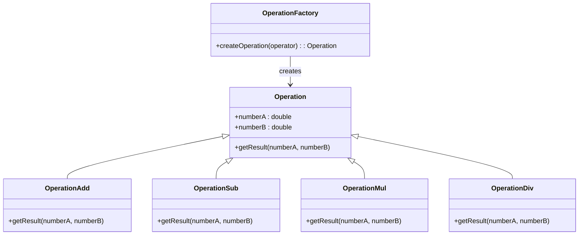
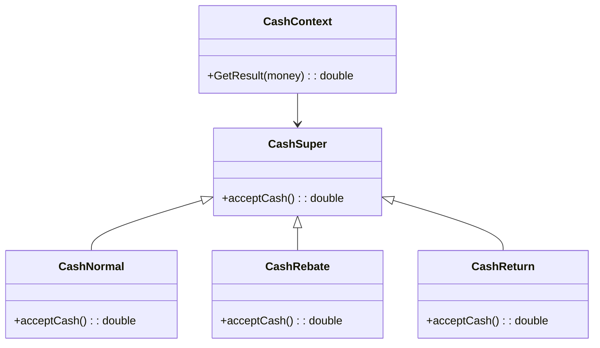

# OOP 面向对象设计模式

## 设计原则
### 单一职责原则

The Single Responsibility Principle，简称 SRP，是指就一个类而言，应该仅有一个更改它的原因。也即这个类只有一个职责。

### 开闭原则

The Open-Closed Principle，简称 OCP，是指软件实体（类、模块、函数等）应该可以扩展，但是不可以修改。即对于扩展是开放的，对于更改是封闭的。通俗来说就是对于要增加的新功能或要调整的改动，尽量扩展新代码而不是修改已有代码。

### 依赖倒置原则

Dependence Inversion Principle，简称 DIP，是指程序不应该依赖细节，细节应该依赖于抽象。简单来说，就是要针对接口编程，不要针对实现编程。

### 里氏替换原则

Liskov Substituion Principle，简称 LSP，一个软件实体如果使用的是一个父类的话，一定适用于其子类，而且它察觉不出父类和子类的区别。也就是说，在软件里面，把父类都替换成它的子类，程序的行为没有变化。简单来说，子类型必须能够替换掉它们的父类型。

### 迪米特法则

Law of Demeter，简称 LoD，也叫最小知识原则。是指如果两个类不必彼此互相通信，那么这两个类就不应当发生直接的相互作用；如果其中一个类需要调用另一个类的某一个方法，可以通过第三者转发这个调用。

## 设计模式

### 简单工厂模式（Simple Factory Pattern）
- 是用一个单独的类来实现具体的实例化过程，避免**客户端**对具体实例化过程的显式指定。
  - 只说一次，客户端就是这个项目的 Calculator.java 是使用该模式的入口，后面的项目也是如此区分，客户端不会放在UML图中
- `java/src/calculator`
- 简单工厂模式由三类主要角色组成：
  * *抽象类*：定义所有支持算法的公共接口，在这个例子中具体运算抽象类；
  * *具体算法类*：具体的算法，在这个例子中具体为加减乘除运算类；
  * *简单工厂类*：维护对运算类的应用。
- 适用于使用者可以在不清楚类生产的具体过程的情况下，使用不同的产品

### 策略模式（Strategy Pattern）
- 是指定义一个*算法家族*，使得家族内的不同算法都遵从算法家族的接口及方法规范，从而可以实现算法间互相替换，且不会影响到使用算法的客户。
- `java/src/cashclient`
- 适用于内部算法很多，经常变化的情况
- 简化了单元测试，每个算法都有自己的类，可以通过自己的接口单独测试
- 符合*开放封闭原则*，无需对上下文修改就可以引进新的策略
- 策略模式由三类主要角色组成：
  * *策略类*：定义所有支持算法的公共接口，在这个例子中具体为收费抽象类；
  * *具体策略类*：具体的算法，在这个例子中具体为各类收费类和折扣优惠收费类；
  * *上下文类*：维护对策略对象的应用。

## 其他学习笔记

抽象类是一种特殊的类，它不能被直接实例化，只能被继承。抽象类的主要用途是为子类提供一种模板，定义某些方法而不具体实现它们。这种设计可以在面向对象编程中实现多态性和代码重用。
